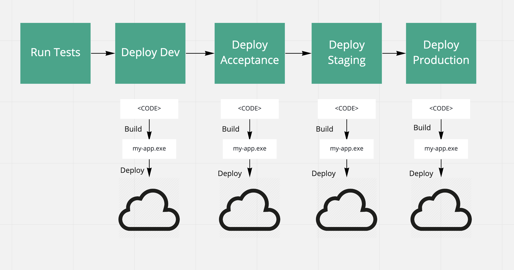
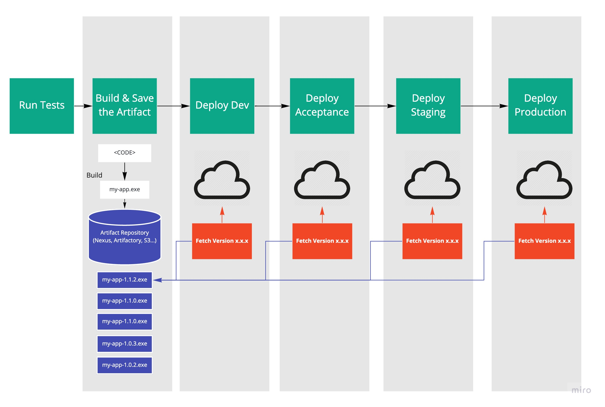

# Goals of this post
1) Make this **interesting** for technical people
1) Make this **acessible** for non-technical people  
    - Communicate difference between source code and an article
1) Communicate value of only building once
    - derisk deployments
    - speed up pipeline
    - provide confidence
1) Explain the idea of Artifact Promotion, why it's valuable, and why bulding once allows us to achieve it


# Iteration 3 -> Attempt to actually write (LOL)

-- Should i make it clear that I'm talking about APP Dev teams or does it not really matter?

### What's an artifact? Why should I care?


When engineers want to deploy their code, they need to build it into an artifact. 
The code is not something that we can just run or deploy, there's a middle step that we need to go through.
 
Almost all software project have a **build** process step where we do two main things.
1) We gather all of the third party code that our code relies on. This is stuff like React, the Spring Framework, or Django.
2) We convert all of the code we need from the **human-readable** code that we write and maintain, and convert it into **machine-readable** code that will actually run on a comptuter.
    - Many compilers or build tools will have optimiztaion steps built in to make your code as efficient as possible.
    - In a compliled lanaguage(Java, C++, Go ect.), the code is converted into machine code. In the case of Java, we crate Java Bytecode. 
    Machines cannot actually exceute cdoe, they need a very detailed set of instructions. The compilation process allows us to work in an easily maintainable language that is close to what we know and understand. 
    
    Here's an example of Some Java Sourcecode... [source](https://en.wikibooks.org/wiki/Java_Programming/Byte_Code)
    ```
     for (int i = 2; i < 1000; i++) {
      for (int j = 2; j < i; j++) {
        if (i % j == 0)
          continue outer;
      }
      System.out.println (i);
     }
     
     ```
     ...and it's respective Java ByteCode
     ```
      0:   iconst_2
      1:   istore_1
      2:   iload_1
      3:   sipush  1000
      6:   if_icmpge       44
      9:   iconst_2
      10:  istore_2
      11:  iload_2
      12:  iload_1
      13:  if_icmpge       31
      16:  iload_1
      17:  iload_2
      18:  irem             # remainder
      19:  ifne    25
      22:  goto    38
      25:  iinc    2, 1
      28:  goto    11
      31:  getstatic       #84; //Field java/lang/System.out:Ljava/io/PrintStream;
      34:  iload_1
      35:  invokevirtual   #85; //Method java/io/PrintStream.println:(I)V
      38:  iinc    1, 1
      41:  goto    2
      44:  return   
    ```

After these steps we have crated an **artifact** that we can run or deploy. 
In the JS wep-app world, we'd have a bundle.js, in Java we'd have .jar file, for C we could have something like a .exe. 
All of these are **artifacts** that we can run.

### Cool so what?



Many teams use CI/CD tools such as Concourse, Jenkins, CircleCI, TeamCity to orchestrate their builds and then deploy their software to various environments (dev, acceptance, staging, prod). 
Using these tools, It's very easy to use a reference to a git commit to refer to a version of your code. 
When deploying the app, they'll pull the code, run a build, then push the code to an environment. A pipeliene step could look something like this.

```
    cf target -s acceptance
    git check-out ${SHA}
    cd my-project
    npm run build
    cf push -p build
```

#### What's the problem with this? 

While the build process is hugely important and valubale, it is also very complex. 
There's a lot that goes into it and a lot that can go wrong.
When a team builds before each push, they're techincally pushing an un-tested artifact. 
It's as if a chef would serve a bowl of soup before they tasted it because they know the recipe should be good.
(Maybe leave out? Anyone who has seen MasterChef knows that you **NEVER** serve something if you haven't tasted it).

Does this REALLY matter though? Aren't computers really good at doing the same thing repeatably? Don't we have tools like package.lock's and build.gradles to make sure builds are consistent?

Builds can always go wrong, and you really don't want your production build to be the one that has a problem.

- No matter what CI tool you're using, you can't guarantee that the environment in which you build is the exact same. 
(SHOULD I TAKE OUT THIS SHOT AT JENKINS) If you're using Jenkins, there's a good chance you're in a stateful environment that can easily change between pushes to different environments, especially if your team is pushing to master frequently ((maybe should take this out too lol) as the should be)).
- Something can just go wrong. There's no such thing as bug-free software. Even compilers and build tools can have issues. They can run out of memory or just get something wrong. Again, you don't want to realize this on your prod push.
- Teams oven break out their deployments into separate pipelines. The different pipeliens can run with different versions of your build tool causing unexpeted behavior.

Versions can also change between builds. Since the artifact you deploy needs to incorporate its libraries, you can end up deploying eitirely different versions of dependencies! 
You haven't tested your integration with it in dev, your pm's havent make sure it works in acceptance, if you have QA they haven't had the chance to ensure that it hasnt broken.
Even if you use something like a package.lock.json, it cannot guarantee that every version is lined up. 
These files do not recursively keep track of the dependencies of every transitive dependency.
Package.lock.json files also often dont use absolue versions, but use minimum versions. This futher increases the uncertainty of what your app will be built with.

Dependencies can also go away over time. [Left Pad](https://www.theregister.co.uk/2016/03/23/npm_left_pad_chaos/) is an infamous example of what happens when a dependency gets taken down. If you had build and stored your artifact, you'd be good to go. If this was taken down between a commit being made and a deployment happening, it would be imposible do deploy.

#### What's should we do instead?



Build your artifact once.


# Iteration 2 -> Themes

### Artifact vs Source Code
    - Analogies
        - Cake vs Recipe -> Deployment analogy kinda falls apart
            - Environment can fuck you up
                - altitude
            - dependcies can fuck you up
                - type or granularity of flour
                
        - Legos vs build model
            - you don't twant to assemble the lego stucure each time
            - people loose pieces
            - people can assemble it wrong
            - stuff goes wrong
            - build the lego set once, make sure it looks good, then treat that as your product
            
### Builds don't always go as expected. You want to deploy the artifact that you vetted.

    - If you build twice...
        - No matter how good your CI tool is, it's not possible to guarantee that build environments are the exact same
                - Easier with concourse
                - Really hard with Jenkins
            - Caches from pevious or other application's builds
            - Something getting corrupted, a bit flipped the wrong way
            - Different versions of a build tool (gradle or npm)
        
        - You can't guarantee you'll get the same dependencies.
            - package.lock.json files DO NOT recursively specify every dependencies transitive dependencies.
            - pacakge.lock.json files can use "greater than" versioning rather than absolute
                - you could pull diffrent versions if you build at different times
            - WHY IS THIS BAD?
                - things may have unexpected interacitons
                - If you have a security dependcy tool, you can't rely on a scan early in the pipeline. you ahve sto scan each time.
                    - if something  bad is found, there's nothing you can do 
                    - Cant "shift left"
                -  dependenceis go away!!!! [Left Pad](https://www.theregister.co.uk/2016/03/23/npm_left_pad_chaos/)
        
### Artifact promotion

    - Confidence in deployment from each environment
    - You ran automted tests against THAT ARTIFACT in the pipeline
    - Yon ran autometed tests against THAT ARTIFACT in a dev environment
    - Your PM accepted the THAT ARTIFACT in staging
    - Your team saw THAT ARTIFACT integrate with dependencies in staging
    - You can now have confidence that THAT ARTIFACT will work well in prod.
    
    - This treats a build as a single unit. This build has been 'stamped' with various levels of approval as it flows through the pipelne
    - This is tracakble and lets you check the box 
    - Reduces complexity
    

          

### Enforces virtuous DevOps practices
    -  you can't go straight to prod, that's the point
        - do the hard things more often
        - makes teams care pipeline
            - speed
            - streamlined
            - efficient
            - reliable
        - nobody can buck up and send an artifact straight to prod, it has do be tested and sent through acceptance.
            - De risks the prod push 
            - Avoids compounding issues
        - by having an artifact of libraries, you can roll back while fixing things if appropriate
        
    - 12 factor app
        - by having one application, you have to configure using the runtime environment, not by different builds
        - app is portable
        
# Iteration 1 -> Risks and Benefits

### risks of NOT doing this
    - Random errors in build
        - Caches
        - Corrupt artifact
        - Unexpected shit happesn
    - Dependencies having changed
        - NPM left pad
    - Package.lock DOES not solve for this
        - it uses minimum versions
        - it doesn't recursively track every transitive dependency
    - Left Pad 
    - You are techincally deploying something that is not testest or scanned

### benfitst of doing this
    - You can deploy something that you've seen work in lower environments
    - Think about promoting a build, not instructions for a build
        - Lego analogy
        - Cooking Analogy?
            - Don't love this one just because food goes bad haha
    - You have an artifact that has various levels of sign-off, certification, or 'stamps'
        - as it elevats from environment to environment its more and more blessed
        - use a diagram here?
        - Tools like concourse keep track of this nicely
    - You can roll back way faster
        - cut the dependency on a build server, it's just deployment you have to worry about 
    - pipelines faster
    - deliver more frequently
    - you can more reliably reproduce production errors
        - this allows you to run the exact piece of wfotware thats running in prod!
    
     
        
 
